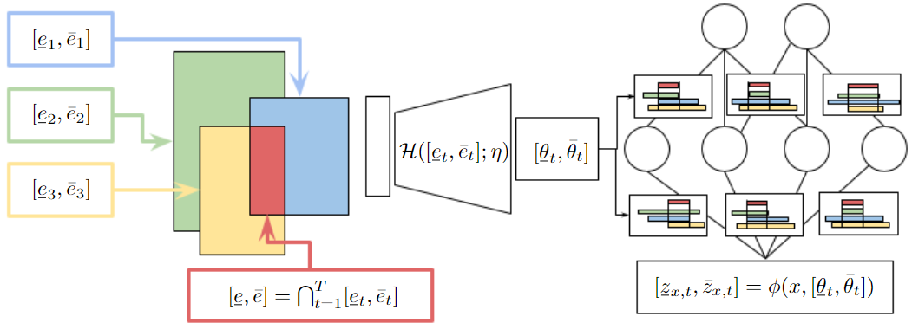

# HyperInterval: Hypernetwork approach to training weight interval regions in continual learning

## Abstract
Recently, a new Continual Learning (CL) paradigm was presented to control catastrophic forgetting, called  Interval Continual Learning (InterContiNet), which relies on enforcing interval constraints on the neural network parameter space. 
Unfortunately, InterContiNet training is challenging due to the high dimensionality of the weight space, making intervals difficult to manage. 
To address this issue, we introduce HyperInterval, a technique that employs interval arithmetic within the embedding space and utilizes a hypernetwork to map these intervals to the target network parameter space. We train interval embeddings for consecutive tasks and train a hypernetwork to transform these embeddings into weights of the target network. An embedding for a given task is trained along with the hypernetwork, preserving the response of the target network for the previous task embeddings. Interval arithmetic works with a more manageable, lower-dimensional embedding space rather than directly preparing intervals in a high-dimensional weight space. Our model allows faster and more efficient training. Furthermore, HyperInterval maintains the guarantee of not forgetting. At the end of training, we can choose one universal embedding to produce a single network dedicated to all tasks. In such a framework, hypernetwork is used only for training and can be seen as a meta-trainer.
HyperInterval obtains significantly better results than InterContiNet and gives SOTA results on several benchmarks. 

## Teaser
Train interval embeddings for consecutive tasks and train a hypernetwork to transform these embeddings into weights of the target network.



## Environment
Use <code>environment.yml</code> file to create a conda environment with necessary libraries: <code>conda env create -f environment.yml</code>.
The [hypnettorch](https://github.com/chrhenning/hypnettorch) package is essential to easily create hypernetworks in [PyTorch](https://pytorch.org/).
Our implementaion is based on the [hypermask](https://github.com/gmum/HyperMask) repository.

## Datasets
For the experiments and ablation study, we use 6 publicly available datasets:
* [Split MNIST](https://arxiv.org/abs/1906.00695)
* [Permuted MNIST-10](https://arxiv.org/abs/1906.00695)
* [Split CIFAR-10](https://arxiv.org/abs/2206.07996) 
* [Split CIFAR-100](https://arxiv.org/abs/2309.14062)
* [TinyImageNet](https://arxiv.org/abs/2309.14062)
* [Permuted MNIST-100](https://arxiv.org/abs/2309.14062) (ablation study)

The datasets may be downloaded when the algorithm runs. For each dataset, the CL task division setup follows the corresponding papers and is specified in our work, supplementary materials.

## Usage
Folder <code>AblationResults</code> contains results of our ablation study, whereas <code>DatasetHandlers</code> and <code>Utils</code> contain handlers and functions for datasets used in the experiments, to apply specific data augmentation policies and task division.
Moreover, folder <code>IntervalNets</code> contains interval implementation of the network architectures used in experiments and <code>VanillaNets</code> contains the basic convolutional network architectures, which are used when applying the interval relaxation technique to the training.

To train HyperInterval in the task incremetal learning (TIL) scenraio, use the command <code>python train_non_forced_scenario.py</code>.
To conduct a grid search in this setup, one should set the variable <code>create_grid_search</code> to <code>True</code> in the <code>train_non_forced_scenario.py</code> file and modify the lists with hyperparameters for the selected dataset in the <code>prepare_non_forced_scenario_params.py</code> file.

To train in the class incremetal learning (CIL) scenraio with nesting protocols, use the command <code>python train_nested_scenario.py</code>.
To conduct a grid search in this setup, one should set the variable <code>create_grid_search</code> to <code>True</code> in the <code>train_nested_scenario.py</code> file and modify the lists with hyperparameters for the selected dataset in the <code>prepare_nested_scenario_params.py</code> file.

To train in the CIL scenario with entropy, set the variable <code>dataset</code> to a name of any of the datasets supported, e.g., <code>dataset = "PermutedMNIST"</code> in the <code>entropy.py</code> file and use the command <code>python entropy.py</code>.


## Citation

```
@inproceedings{krukowski2024hyperinterval,
  title={HyperInterval: Hypernetwork approach to training weight interval regions in continual learning}, 
  author={Patryk Krukowski and Anna Bielawska and Kamil Książek and Paweł Wawrzyński and Paweł Batorski and Przemysław Spurek},
  booktitle={Advances in Neural Information Processing Systems (NeurIPS)},
  year={2024}
}
```

## License

Copyright 2024 IDEAS NCBR <https://ideas-ncbr.pl/en/> and Group of Machine Learning Research (GMUM), Faculty of Mathematics and Computer Science of Jagiellonian University <https://gmum.net/>.

This program is free software: you can redistribute it and/or modify it under the terms of the GNU General Public License as published by the Free Software Foundation, either version 3 of the License, or (at your option) any later version.
You should have received a copy of the GNU General Public License along with this program. If not, see <https://www.gnu.org/licenses/>.
